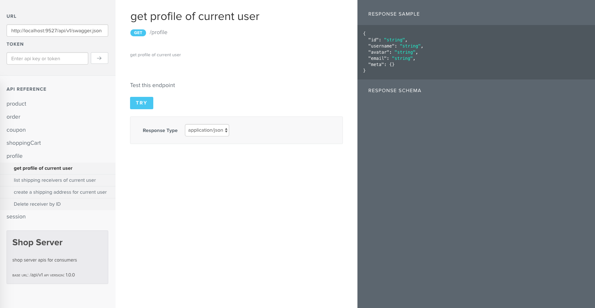

# sketch-es6-basic

[](https://travis-ci.org/zzswang/express-swagger-fancy)

Thanks to [jensoleg's work](https://github.com/jensoleg/swagger-ui).
**quick preview**




## you will have

1. Fancy swagger ui.
2. Ability to test your api.

## quick start

```
npm install express-swagger-fancy --save
```

```js
import swagger from 'express-swagger-fancy';

// swagger(path to swagger.json file)
app.use('/doc', swagger(path.join(__dirname, '../swagger.json')));
```

visit `http://localhost:port/doc` you will see a nice look swagger ui.